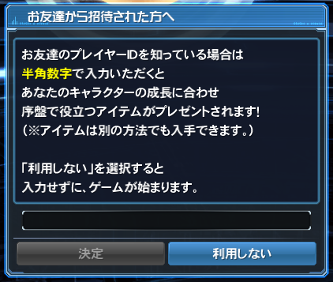

## What is PSO2?
**Phantasy Star Online 2 (PSO2)** is a free-to-play Action Online RPG created by SEGA, released originally in Japan on July 2012, with servers released in **South East Asia (SEA)** and **Taiwan (TW)**, with an upcoming server in **North America (NA)** being released sometime in Spring 2020. The SEA servers were terminated in 2017, along with the Taiwan servers.

PSO2 has been released on the **Playstation 4**, **Nintendo Switch** (Cloud streaming version only), **Playstation Vita**, **PC**, and **Xbox One** (NA exclusive). PSO2 has also spawned several side games, two released on mobile **(PSO2es & Idola: Phantasy Star Saga)** and another game that is separate to the main story of PSO2 **(Phantasy Star Nova)**, also released on the Vita.

## Getting the game

### PC
You will need to setup an account with SEGA on their japanese website. A detailed guide can be found [here](http://www.bumped.org/psublog/phantasy-star-online-2-registration-guide/).

You will also need to download the game, which at the time of writing, is **70 GB**. More information on installing and setting the game up using the English Patch using the PSO2 Tweaker can be found [here](http://www.bumped.org/psublog/phantasy-star-online-2-registration-guide/).

### PS4
**WARNING: Upon starting either the PS4 or PSVita versions of the game, you will be prompted to log in using your SEGA ID. Upon logging in for the first time, your PlayStation Network ID will become BOUND to the SEGA ID, and you will not be able to use your SEGA ID on any other PlayStation Network ID. This process cannot be undone!**

There are two methods of obtaining the PS4 version: Download and Physical.

#### Download
You must create a Japanese PSN ID to download the free version of the game. Instructions to create a Japanese PSN can be found [here](https://www.vg247.com/2018/09/11/how-to-create-a-japanese-psn-account-japan-exclusive-ps4-demos-themes-games/).

#### Physical
If you have the disk version of the game, the game can be installed on any PS4 system. A Japanese PSN is not required to install or play the game via disk.

### PSVita
Much like the PS4 version, it is possible to get the game via digital download or physical versions. It is also possible to download the game if you have custom firmware installed.

#### Download
You must create a Japanese PSN ID to download the free version of the game, as well as have a spare memory card to download the game on. You must also have a memory card of size **32 GB** or higher to install the game.

#### Physical
If you have the Game Card version of the game, the game can be installed on any PSVita system. This can be done without the use of a Japanese PSN ID or a separate memory card. Much like the download version, you must have a **32 GB** memory card or larger to update the game.

**CFW**

### Switch (PSO2 Cloud)
You must create a Japanese Profile on your Nintendo Switch to download PSO2 Cloud. To do so, simply create a new Profile on your Switch and set the Profile's locale to "Japan".

Unlike other versions of the game, the version on the Nintendo Switch is streamed to your system over the internet via a cloud server. As such, **this version of the game may not work as intended depending on location and internet quality.**

## Starting & selecting a ship

### PC
PSO2 divides each server into "Ships". There are 10 ships in total, with each with its own game lobby instance. They are as followed:
* Ship01: Feoh
* Ship02: Ur
* Ship03: Thorn
* Ship04: Ansur
* Ship05: Laguz
* Ship06: Ken
* Ship07: Geofu
* Ship08: Wynn
* Ship09: Hagall
* Ship10: Nauthiz

The majority of the English community is located in Ship02: Ur, and the most populated overall is Ship04: Ansur.

When starting the game for the very first time and logging in using the **Japanese launcher** or the **PSO2 Tweaker**, you'll be asked to enter a Player ID number. 

If you start Phantasy Star Online 2 through the Friend Invitation System, you will receive many presents per levels of 10. If you would like to receive these benefits and don't already have a referral player ID number, enter `13174572` in the dialog box as show above.
