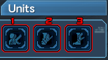

As with every online game, PSO2 has its own bundle of new words to learn and digest. So to make it easier, we'll divide up the terminology by category.

#### Rarity
PSO2 has a basic rarity system that those who played the previous series, namely Phantasy Star Universe, will be familiar with.

Equipment rarity ranges from a rarity of ★1 to a rarity of ★15, with ★1 being common and ★15 being super rare.

#### RNG
A random number generator, a system that randomly generates a number. Game developers build drop systems with RNG in mind.

Players are known to "pray" to RNGesus (RNG + Jesus) to bless them with luck in item drops or improving their equipment.

#### Desire Sensor
A mythical sensor that somehow knows what you are trying to hunt down and "gifts" you a "gift" in the form of a troll item drop, or by giving the item you wanted to your friends instead.

Some players swear by this sensor and go to great lengths to avoid tripping it. Often lumped together with RNGesus.

#### Whales & Whaling
**Whale**,(/(h)wāl/) a noun.

Whales are players who have some sort of disposable income IRL. They are known to throw money at the game to obtain cosmetics and other things.

**Whaling**, (/ˈ(h)wāliNG/) a verb.

The act of spending real money, usually loads of it.

#### Mates & Atomizers (Healing Items)
A staple in the Phantasy Star series, the basic healing items make a return. A difference from the previous series however, is that you're unable to hold more than 5 **Atomizers** and each healing item has an animation.

* Monomate = A small heal effect
* Dimate = A medium heal effect
* Trimate = A large heal effect
* Moon Atomizer = Allows you to revive other players within range, cannot revive yourself.
* Sol Atomizer = Cures you and others within range of a status ailment
* Star Atomizer = Cures status ailments and heals players (including you) within range. 
* Cosmo Atomizer = OP healing item that only real money can buy. Do not buy this unless you have disposable income.

#### Currency
PSO2, like all other online games, has multiple currencies. The main currency from the previous games, **Meseta**, makes a return to PSO2 as its in-game only currency. 

There is also **ARKS Cash**, or **AC**. This is the premium currency that can only be obtained by purchasing with real money (:whale2:). This is mostly used for cosmetics, but can also be used to purchase other things in the game. Thankfully, it's impossible to buy your way into getting gear using real money.

**Star Gems** or **SG**, is the currency that is mostly used as a gatekeeper to all things time based, cosmetics and skill trees. You can get this for free, or by whaling your way in.

**FUN Points** or **FUN**, is a currency mostly obtained via playing the game, such as logging in daily or reviving other players.

**Casino Coins** or **CC**, is the currency used by the Casino Area. It can be obtained from Casino Coin Passes and can be gambled away via a variety of minigames. Casino Coins can be used to purchase Casino-themed cosmetics or a variety of helpful items.

**Challenge Miles** or **CM**, is a currency obtained by playing the Challenge Quest mode.

**Battle Coins** or **B**, is a currency obtained by playing the game's Player vs. Player mode, Battle Arena.

**NetCafe Points** or **C**, is a currency obtained by playing the game via a certified Japanese internet cafe.

#### Player Stats
As per all RPGs, Phantasy Star Online 2 uses a slough of stat types that increase specific attributes to your player character. Some increase your weapon damage, others increase your damage variance, and your defense. Here is a breakdown of each stat-type:

* **HP** - Your health points.
* **PP** - **Photon Points**, PP is consumed every time a **Photon Art** (PA) or **Technique** is used, and if there is not enough PP, the PA or Technique cannot be used. You can recover spent PP by using normal attacks.
* **S-ATK** - **Striking Attack**, deals striking type damage. Weapons that scale off S-ATK deal striking based damage.
* **R-ATK** - **Ranged Attack**, deals ranged type damage. Weapons that scale off R-ATK deal ranged based damage.
* **T-ATK** - **Technique Attack**, deals technique type damage. Weapons that scale off T-ATK deal technique based damage.
* **DEX** - **Dexterity/Skill**, controls your damage variance. All weapons and enemies have a hidden dex stat that determines the damage variance. A higher enemy dex and a lower weapon and player dex score will deal low damage, whereas a weapon and player dex score that is higher than an enemy will increase your damage. Unless otherwise stated in certain class build guides, you don't have to worry about increasing this particular stat as the base number is usually enough.
* **S-DEF** - **Striking Defense**, determines how much damage is reduced from enemy striking attacks.
* **R-DEF** - **Ranged Defense**, determines how much damage is reduced from enemy ranged attacks.
* **T-DEF** - **Technique Defense**, determines how much damage is reduced from enemy technique attacks.
* **Attr. Resists** - **Attribute Resists**, these determine how much elemental attribute damage is reduced from enemy attacks. Each enemy attack, on top of being a striking, ranged, or technique based attack, also may use certain elemental type of attacks that are affected by your Elemental Attribute Resists.

#### Weapons
Weapons are divided into three separate types, **Striking**, **Ranged** and **Technique**.

Striking-type weapons include **Swords, Wired Lances, Partizans, Knuckles, Twin Daggers, Double Sabers, Katanas, Dual Blades, and Gunslashes**. Ranged-type weapons include **Assault Rifles, Launchers, Compound Bows, Gunslashes & Twin Machineguns**. Technique-type weapons include **Rods, Wands, Talises, Jet Boots, andTakts**.

The gunslash is a weapon that is a fusion of a gun and a saber, that allow you to swap between its gun and blade modes. Each of the weapons will perform differently depending on the class they are used with.

Weapons in PSO2 also can be improved upon to increase their stats and allow players to augment their own stats by adding **special abilities** or **affixes** on to the weapon itself. **Strengthening** or 
**grinding** weapons to increase their stats can also unlock their **potential ability** and if the weapon supports it, their **Special Ability Factor (SAF)**.

#### Weapon Action
Some weapons in PSO2 have an alternative action that can be performed, called a **Weapon Action**. Some classes can even change what the Weapon Action on a weapon does.

#### Units (Armor)
In very much the same in other RPGs, protecting yourself using armor is very important. Phantasy Star Online 2's quests can give the average player a hard time or an easier time with the right armor and weapon on their side. PSO2's armor unit system also allows players to augment their stats in a similar fashion to weapons.

There are 4 types of units, **Rear, Arm, Leg, and Sub.** 

1. This slot is reserved for rear units. Rear units are defined by having **Rear** in their name.
2. This slot is reserved for arm units. Arm units are defined by having **Arm** in their name.
3. This slot is reserved for leg units. Leg units are defined by having **Leg** in their name.

Sub units are definied by having **Sub** in their name. They may be placed into any armor slot.

#### Weapon & Unit Grinding

#### Photon Arts & Techniques (PA/Techs)
**Photon Arts (PA)** are powerful attacks that weapons for each [class](/../classes/) can unleash.

**Techniques (Tech)** are elemental attacks that certain classes can use.

Both PAs and Techs require PP to use them. Most weapons allow for use of this, and allows for customization of the ordering of PAs via the [Weapon Palette](/../Guides/basics/menu/).

#### Special Ability (Affixes)
Special Abilities are augmentations that may come with a piece of equipment. They can also be added into your existing weapons and units as well. The English community refers to them as **Affixes**.

Special Abilities can help augment your player stats and thus learning to affix your own equipment is a crucial step in overall player progress.

#### Super Special Abilities (SSA)
Super Special Abilities are a subset of special abilities that only certain weapons and ★13 units can utilize. They often have separate modifiers or skills that can go on to existing equipment.

#### Potential Abilities
Weapons that are grinded to their maximum will have separate ability that differs from normal special abilities, but are closer to Super Special Abilities in terms of their effects.

Every weapon has a potential ability and is always recommended to seek weapons with powerful potential abilities. Some can have high damage percentage modifiers that can cause a lower rarity weapon to equal or exceed a higher rarity weapon.

#### Fodder
Equipment that its only purpose in life is to be used as material for improving one's other equipment during affixing.

#### Client Orders (COs)
"Quests" given by NPCs. Avoid calling them quests or missions as those terms are used for completely different things.

#### Difficulty
There are six difficulties. Certain rarity of equipment are only available on higher difficulties.

1. **Normal (N)**
2. **Hard (H)**
3. **Very Hard (VH)**
4. **Super Hard (SH)**
5. **Extra Hard (XH)**
6. **Ultra Hard (UH)**

Most endgame content (at the time of writing) is centered on XH and UH.

#### Party

#### Quest Types

#### PSE & PSE Bursts

#### Criticals
The bright blue numbers you get when hitting things. Normal damage is in white. Unlike other games however, criticals in PSO2 do not grant extra damage. They instead grant the highest damage possible within your damage range. For example, if your damage ranges between 3,000 and 24,000 damage, your critical hit would yield the 24,000 damage.

Increasing your critical hit will improve the chances that you hit for your maximum, with a 100% critical rate will guarantee that you are hitting for your maximum possible damage.

#### Just Attacks
Just Attacks, or JAs are the act of timing your attacks according to the timing circle that appears around you after an attack. When it’s red, you attack. Doing so gives a damage bonus towards the attack you “Just attacked” with.

It is not stressed enough how important players should master their Just Attack timings.

#### Classes
PSO2 has 15 classes total, each are usually abbreviated when talking about them.

They are as followed:
* Hunter = HU
* Ranger = RA
* Force  = FO
* Fighter = FI
* Gunner = GU
* Techer = TE
* Braver = BR
* Bouncer = BO
* Summoner = SU
* Hero = HR
* Phantom = PH
* Etoile = ET

#### Old Type & New Type
Upon it's initial release until 2015, PSO2 was saturated with a certain class of weapon that required you to throw meseta at the Item Lab NPCs to improve the strength of your weapon with a heavy dose of RNG (Random Number Generator). The process was long and required large sums of meseta and materials, it was a common process to go from riches to rags with this system.

While some strange and masochistic players enjoyed this lengthy and costly process, a growing number of players did not. SEGA implemented a new type of weapon class called **"New Type"** or **NT**, which eventually phased out the older system and weapons now dubbed as **"Old Type"** or **OT**.

NT weapons were different as they featured an EXP bar and no RNG to improve them. Weapon EXP was gained by using other weapons as **Grind EXP**, which also increased the grind cap to +35. (Old Types were capped at +10.)

#### Mags & Photon Blasts

